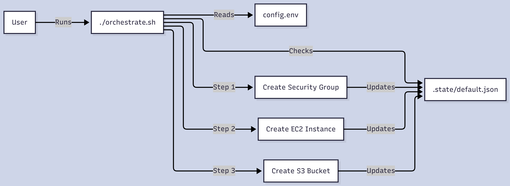
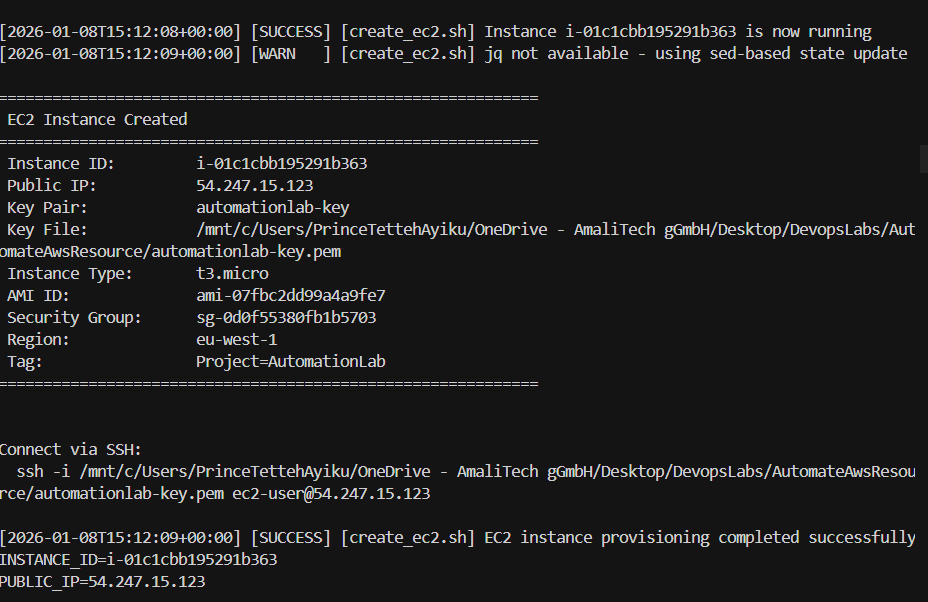
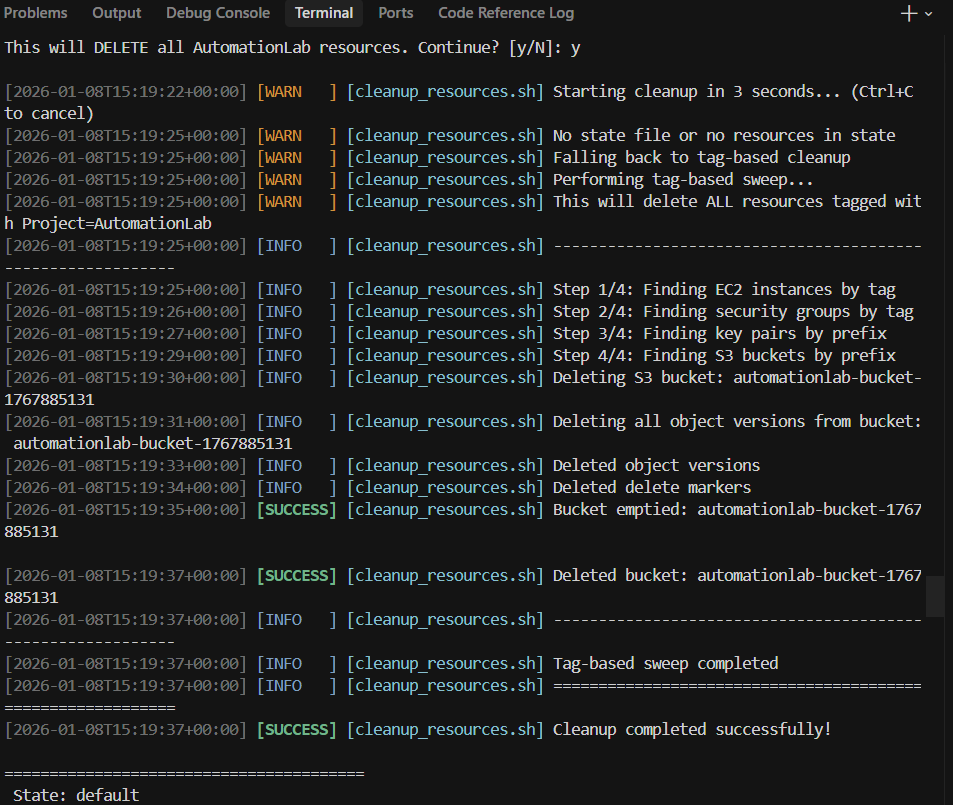

# AWS Infrastructure Automation with Bash


A robust, idempotent, and state-aware automation suite for provisioning AWS resources (EC2, Security Groups, S3). This project implements **Infrastructure as Code (IaC)** principles using pure Bash, featuring Terraform-like state management, **S3 remote state backend**, atomic locking, and industry-standard logging.

---

## 📖 Table of Contents
- [Architecture](#-architecture)
- [Prerequisites](#-prerequisites)
- [Quick Start](#-quick-start)
- [Key Features](#-key-features)
- [S3 Remote State Backend](#-s3-remote-state-backend)
- [Configuration](#-configuration)
- [Project Structure](#-project-structure)
- [Challenges & Solutions](#-challenges--solutions)

---

## 🏗 Architecture

This system uses an **Orchestrator Pattern** to manage dependencies and a **JSON State File** to track resources.




### Resource Dependency Flow
1.  **Security Group**: Created first to allow SSH (22) and HTTP (80).
2.  **EC2 Instance**: Launched using the Security Group ID and a generated Key Pair.
3.  **S3 Bucket**: Provisioned with versioning enabled and public-read access.

---

## 🛠 Prerequisites

Ensure you have the following installed:

*   **AWS CLI v2**: Configured with valid credentials (`aws configure`).
*   **Bash**: Version 4.0 or higher.
*   **jq** (Recommended): For robust JSON parsing (scripts include fallbacks if missing).

### Installation

```bash
# Clone the repository
git clone <your-repo-url>
cd AutomateAwsResource

# Make scripts executable
chmod +x orchestrate.sh scripts/*.sh
```

---

## 🚀 Quick Start

The system is controlled via the `orchestrate.sh` entry point.

### 1. Provision Resources (`apply`)
Creates all resources in the correct dependency order.

```bash
./orchestrate.sh apply
```

**Expected Output:**


**Success Output:**



### 2. Check Status
View currently tracked resources in the state file.

```bash
./orchestrate.sh status
```

### 3. Cleanup (`destroy`)
Reliably destroys resources in reverse dependency order (S3 -> EC2 -> SG).

```bash
./orchestrate.sh destroy
```

**Expected Output:**



---

## 💎 Key Features

### 1. Terraform-like State Management
Unlike typical Bash scripts that "fire and forget," this project maintains a local state file (`.state/default.json`).
*   **Benefits**: Allows accurate cleanup and prevents "orphaned" resources.
*   **Implementation**: `lib/state.sh` uses atomic writes and file locking.

### 2. Idempotency
Run `apply` as many times as you want. The scripts check the state and AWS API before creating resources.
*   *If a Security Group exists, it uses it.*
*   *If an EC2 instance is running, it doesn't create a duplicate.*

### 3. Robust Error Handling
*   **Trap Handlers**: If the script fails mid-execution, a `trap` catches the signal and provides recovery instructions.
*   **Retries**: Network calls to AWS are wrapped in retry logic with exponential backoff.
*   **Validation**: Inputs (Region, AMIs, IDs) are validated against Regex patterns before use.

### 4. Advanced Logging
Logs are structured, timestamped, and color-coded.
*   **Console**: Human-readable with colors.
*   **File**: Machine-readable (plain text) saved to `*.log`.

---

## ☁ S3 Remote State Backend

For team collaboration and disaster recovery, state can be stored in S3 instead of locally.

### Enable S3 Backend

```bash
# Option 1: Environment variable
STATE_BACKEND=s3 ./orchestrate.sh apply

# Option 2: Set in config.env
export STATE_BACKEND="s3"
```

### Features
| Feature | Description |
|---------|-------------|
| **Versioning** | S3 bucket versioning enabled for state history |
| **Encryption** | Server-side encryption (SSE-S3) by default |
| **Locking** | Simple S3-based locking prevents concurrent modifications |
| **Auto-create** | Bucket auto-created if it doesn't exist |

### State Commands

```bash
./orchestrate.sh state init      # Initialize S3 backend
./orchestrate.sh state pull      # Pull state from S3
./orchestrate.sh state push      # Push state to S3
./orchestrate.sh state unlock    # Force unlock (recovery)
./orchestrate.sh state status    # Show backend info
```

### Destroy with Backend Cleanup

```bash
# Destroy resources only
./orchestrate.sh destroy

# Destroy resources AND the S3 state bucket
./orchestrate.sh destroy --backend
```

---

## ⚙ Configuration

All settings are centralized in `config.env`.

| Variable | Default | Description |
|----------|---------|-------------|
| `AWS_REGION` | `eu-west-1` | Target AWS Region |
| `PROJECT_TAG` | `AutomationLab` | Tag used for billing and cleanup |
| `NAME_PREFIX` | `automationlab` | Prefix for resource naming |
| `INSTANCE_TYPE` | `t3.micro` | EC2 Instance Size |
| `STATE_BACKEND` | `local` | State backend: `local` or `s3` |
| `STATE_S3_BUCKET` | (auto) | S3 bucket for remote state |

To override without changing the file:
```bash
AWS_REGION=us-east-1 ./orchestrate.sh apply
```

---

## 📂 Project Structure

```text
.
├── orchestrate.sh          # Main entry point (CLI)
├── config.env              # Central configuration
├── lib/
│   ├── common.sh           # Shared utilities & AWS wrappers
│   ├── logging.sh          # Logging framework
│   ├── state.sh            # State file management
│   └── validation.sh       # Input validation logic
├── scripts/
│   ├── create_security_group.sh
│   ├── create_ec2.sh
│   ├── create_s3_bucket.sh
│   └── cleanup_resources.sh
└── .state/
    └── default.json        # Infrastructure state (do not edit manually)
```

---

## 🔧 Challenges & Solutions

During development, several challenges were encountered and resolved:

| Challenge | Solution |
|-----------|----------|
| **CRLF Line Endings** | Windows creates files with `\r\n`. Fixed with `sed -i 's/\r$//'` |
| **AWS CLI Output Whitespace** | SG IDs had trailing newlines. Fixed with `tr -d '[:space:]'` |
| **State without jq** | Implemented `sed`/`awk` fallbacks for JSON manipulation |
| **Versioned S3 Cleanup** | Must delete all object versions before bucket deletion |
| **Subshell Variable Loss** | `parse_args` used global vars instead of `echo` + subshell |

---

## 🤝 Contributing

1. Fork the repository
2. Create a feature branch (`git checkout -b feature/amazing-feature`)
3. Commit your changes (`git commit -m 'Add amazing feature'`)
4. Push to the branch (`git push origin feature/amazing-feature`)
5. Open a Pull Request

---

## 📝 License

This project is part of the DevOps Automation Lab. Licensed under MIT.

---

## 👤 Author

**Prince Tetteh Ayiku**

*AmaliTech DevOps Training Program*
